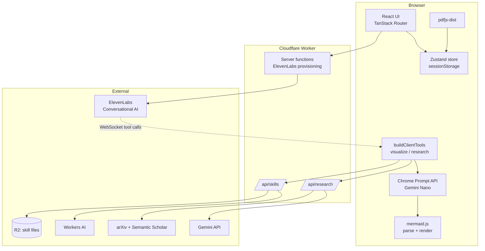

# Architecture

Multimodal Scholar is a voice-first research companion: you drop in a paper,
talk to an AI about it, and it draws slides on a canvas in real time while you
speak.

This document describes every component and walks the full chain from cold
start to hanging up the call.

---

## 1. The shape of the system



The defining property: **the backend is almost empty.** Two API routes and
three server functions. Everything expensive — PDF parsing, visual generation,
diagram rendering — happens in the browser.

---

## 2. Front end / back end split

### Browser (the bulk of the app)

| Concern | Implementation |
|---|---|
| Routing / SSR | TanStack Start + TanStack Router (file-based, `src/routes/`) |
| UI | React 19, Tailwind CSS 4, shadcn/ui on Radix primitives, `lucide-react` icons, `sonner` toasts |
| State | Zustand with `persist` middleware → `sessionStorage` |
| PDF text extraction | `pdfjs-dist` (worker thread) |
| Voice session | `@elevenlabs/react` `useConversation` over WebSocket |
| Visual generation | Chrome's built-in Gemini Nano via the Prompt API |
| Diagram render | `mermaid` 11 |
| Chart render | `recharts` |
| Math render | `katex` / `react-katex` |

### Cloudflare Worker (thin)

| Endpoint | Purpose |
|---|---|
| `startScholarVoiceSession` (server fn) | Provision/sync the ElevenLabs agent, mint a signed WS URL |
| `getElevenLabsConversationToken` / `...SignedUrl` (server fns) | Lower-level variants |
| `POST /api/research` | Gemini synthesis + live citation resolution |
| `GET/POST /api/skills` | Read/distill the persistent per-kind skill files |

`src/server.ts` wraps TanStack's server entry to (a) inject Cloudflare bindings
into a module-level holder via `setCfBindings(env)`, and (b) convert h3's
swallowed SSR errors — which arrive as a bland `{"unhandled":true}` 500 — into
a branded error page.

### Why the split lands here

Three things forced work into the browser, and each one is load-bearing:

1. **PDF text** must be extracted client-side anyway (the file never leaves
   the machine), so the full paper text already lives in the browser.
2. **Visual generation** moved on-device for latency: in a live voice call the
   agent keeps talking while the slide renders, so a network round trip is a
   second of visible spinner.
3. **Mermaid** is a browser library, so validating with mermaid's *real*
   parser is only possible client-side.

What's left server-side is exactly what needs a secret (ElevenLabs and Gemini
keys) or a binding (R2, Workers AI).

---

## 3. Component inventory

### `src/routes/`
- `__root.tsx` — document shell, meta tags
- `index.tsx` — landing page, PDF dropzone
- `session.tsx` — the three-pane session view (`ssr: false`, since it's
  entirely client state)
- `dev-harness.tsx` — dev-only tool-call form (no voice, no keys needed)
- `dev-mermaid-harness.tsx` — dev-only; exposes `renderMermaidToSvg` and
  `parseMermaid` as globals for the Playwright corpus test
- `api/research.ts`, `api/skills.ts` — the two surviving API routes

### `src/lib/scholar/`
| File | Role |
|---|---|
| `store.ts` | Zustand store: `pdf`, `canvasItems`, `researchItems`, `transcript`, `lessons` |
| `agent-tools.ts` | **The agent harness.** Implements the `visualize`/`research` client tools and the self-correcting generation loop |
| `on-device.ts` | Chrome Prompt API wrapper — availability, sessions, structured output, quota |
| `illustrate-shared.ts` | Pure, isomorphic: Zod + JSON schemas, validators, per-kind prompts |
| `scholar-agent-config.ts` | Single source of truth for the ElevenLabs agent's prompt + tool schemas |
| `voice-session.ts` | Per-session prompt override carrying the paper text |
| `research.server.ts` | Gemini synthesis, citation-context assembly |
| `citations.server.ts` | arXiv + Semantic Scholar clients |
| `references.ts` | Heuristic bibliography parser + query ranking |
| `skills.server.ts` | Per-kind persistent skill files in R2 |
| `pdf.ts` | `pdfjs-dist` text extraction |

### `src/lib/mermaid/`
- `render.ts` — real `mermaid.render()`, shared by production and tests
- `validate.ts` — real `mermaid.parse()`, the authoritative validation gate
- `themes.ts` — theme configs

### `src/components/scholar/`
- `VoicePanel.tsx` — the ElevenLabs session, mic controls, transcript
- `CanvasPane.tsx` — the slide deck
- `ResearchFeed.tsx` — background research results
- `a2ui/{Mermaid,Chart,Math,Table}View.tsx` — one renderer per visual kind

---

## 4. The agent harness

There are **two** agent layers, and conflating them causes confusion.

### Layer 1 — the voice agent (not ours)

ElevenLabs runs the conversational loop entirely server-side: speech-to-text,
LLM, turn-taking, barge-in, text-to-speech. This codebase contains **no
orchestration loop, no message history, no turn management** for it.

What we own is configuration-as-code. On cold start,
`ensureScholarAgentId()` searches the workspace for an agent named
`"Scholar (auto)"`, creates it if missing, and `PATCH`es it to match
`scholar-agent-config.ts` if present. The dashboard is never the source of
truth. (This exists because an agent created with an older tool set rejects
new tool calls with `LLM Cascade Error: Tool not found in available tools`.)

### Tool calls are fire-and-forget

Tools are registered with `expects_response: false`. That single flag defines
the architecture:

```
agent decides → WS tool-call frame → clientTools.visualize(params)
                                       ├─ upsertCanvas({status:"pending"})   ← UI updates NOW
                                       ├─ void (async () => { ...generate... })()  ← detached
                                       └─ return "queued, keep talking"      ← ~0ms
                                                    ⋮
                                     sendContextualUpdate("[VISUAL READY: ...]")  ← out of band
```

The returned string is an acknowledgement, not a result. The real output comes
back later through a **separate** WebSocket message that injects text into the
running conversation, which the agent weaves in as if it had always known it.
That inversion is what makes multi-second generation survivable in a voice UI.

Because results can arrive before the socket connects, `VoicePanel.tsx` keeps
a queue (`contextualUpdateQueueRef`) flushed on `onConnect`.

### Layer 2 — the visualize sub-agent (ours)

This is the self-correcting loop, in `generateVisualWithRetries`:

```
                 ┌─────────────────────────────────────────┐
                 ▼                                         │
   generate on-device                                      │
          │                                                │
          ├─ gate 1: runContentValidations  ──fail──────────┤
          │    structural, synchronous, model-actionable    │  correction =
          │                                                 │  reason + the
          ├─ gate 2: mermaid.parse()  ──fail────────────────┤  failing output
          │    the real grammar (diagrams only)             │
          │                                                 │
          └─ pass → accept ─────────────────────────────────┘
                                              (max 5 attempts)
```

Two gates in cost order. Gate 1 is a hand-rolled structural check whose
rejection reasons are written for a model to act on. Gate 2 is mermaid's own
parser — the authority on whether a diagram renders. Gate 1 is an
approximation of gate 2, so it always had a false-negative class; running in
the browser lets us close it *inside* the loop.

Each attempt gets a **fresh cloned session**, not a continuing conversation.
The model sees the same information either way (the failing output is passed
explicitly), but a fresh session keeps input usage flat — and Prompt API quota
overflow evicts oldest-first, which is the system prompt holding the format
rules.

Retries are affordable here in a way they never were against a metered API:
no network, no rate limit, no cost.

### The division of labour

The voice agent holds the entire paper (~28k chars in its prompt). Gemini Nano
holds none of it. So:

> **Strong model extracts. Weak model formats.**

The agent picks `kind`, writes a one-line `hint`, and puts the actual paper
content in `facts`. The on-device model only renders that into a schema. This
is why the tool has a `facts` parameter at all, and why an under-filled
`facts` produces a generic slide — the renderer literally cannot see the PDF.

---

## 5. External APIs

| API | Called from | Auth | Used for |
|---|---|---|---|
| ElevenLabs REST | Worker | `ELEVENLABS_API_KEY_1` | Agent provisioning, signed URLs |
| ElevenLabs WebSocket | Browser | Signed URL | The live voice session |
| **Chrome Prompt API** | Browser | **none** | All visual generation + teasers |
| Gemini (`@google/genai`) | Worker | `GEMINI_API_KEY` | Research synthesis |
| arXiv Atom API | Worker | none | Citation resolution |
| Semantic Scholar Graph | Worker | none | Citation resolution (preferred) |
| Workers AI (binding) | Worker | binding | Skill-file distillation |
| R2 (binding) | Worker | binding | Skill-file storage |

Note the asymmetry: the most latency-critical path (`visualize`) is the only
one with **no network call and no API key**.

---

## 6. Full walkthrough

### Step 0 — Cold start

`src/server.ts` boots, calls `setCfBindings(env)` to stash the R2 and Workers
AI bindings, and hands off to TanStack's server entry. `/` renders server-side.

### Step 1 — User drops a PDF

`routes/index.tsx` → `handleFile()`:

1. `resetStore()` clears any prior session.
2. `extractPdfText(file)` (`pdf.ts`) dynamically imports `pdfjs-dist`, spins up
   its worker, and walks every page, joining text items with spaces and
   inserting `\n\n--- Page N ---\n` markers. Capped at 250k chars. **The file
   never leaves the browser.**
3. `setPdf({name, text, pages, charCount})` → Zustand → persisted to
   `sessionStorage`.
4. `dispatchSpeculativeVisual(file.name)` fires and forgets: checks on-device
   availability and pre-creates the diagram session so its ~1,600-token system
   prompt is already processed before the first real slide.
5. `navigate({to: "/session"})`.

### Step 2 — Session view mounts

`routes/session.tsx` (`ssr: false`) renders three panes: `VoicePanel`,
`CanvasPane`, `ResearchFeed`. If the store has no PDF after 50ms it bounces
back to `/`.

### Step 3 — User clicks Start

`VoicePanel.start()`:

1. Calls the `startScholarVoiceSession` server function.
2. Worker side: `ensureScholarAgentId()` finds-or-creates the agent and PATCHes
   its config, then mints a signed WebSocket URL.
3. Client opens the session via `useConversation().startSession()`, passing
   `buildScholarVoiceSessionOptions(signedUrl, pdf)` — which includes an
   **override** carrying the paper-specific system prompt with up to 28.7k
   chars of PDF text inlined.
4. `onConversationCreated` fires `sendContextualUpdate` with the paper context
   and `dispatchPreemptiveResearch()` — two background research queries so
   grounding is warm before the user asks anything.

### Step 4 — User speaks

Audio streams to ElevenLabs. STT → LLM → the LLM decides to call `visualize`
(mandatory every turn) and possibly `research`. Tool-call frames arrive over
the WebSocket; `@elevenlabs/react` dispatches them into our `clientTools`
object. **We never see the LLM.**

### Step 5 — `visualize` executes

`agent-tools.ts`:

1. `resolveKind(params)` — trust the agent's enum, default to `diagram`.
2. `upsertCanvas({status: "pending"})` — the card appears **immediately**.
3. `dispatchVisualTeaser()` — a fast one-line preview from Nano patches the
   card's narration within ~1s, so it isn't a bare spinner.
4. Returns the acknowledgement string. **The tool call is now done** (~0ms).
5. Detached: `isOnDeviceReady()` gates, then `generateVisualWithRetries()` runs
   the two-gate loop from §4, with `skillRulesForKind(kind)` folded into the
   system prompt.
6. On success: `patchCanvas({status:"ready", payload})` and
   `sendContextualUpdate("[VISUAL READY: ...]")` back into the conversation.
7. On failure: a visible error card plus `[VISUAL FAILED: ...]` to the agent.
8. Rejected attempts become kind-tagged `lessons` in the store.

### Step 6 — `research` executes (if called)

1. `collectCitationCandidates()` runs `extractReferences()` over the **full**
   PDF text (references live at the end, past any excerpt) and ranks them
   against the query by keyword overlap.
2. `POST /api/research` with the query, a 12k-char excerpt, and the ranked
   candidates.
3. Worker: `buildCitationContext()` resolves each candidate through Semantic
   Scholar (preferred) then arXiv, and formats real fetched abstracts into a
   `REAL CITED PAPERS` block.
4. Gemini synthesizes a briefing grounded in that block.
5. Client patches the research feed and streams the **full** briefing back as a
   contextual update so the agent can weave it into speech.

### Step 7 — The slide renders

`CanvasPane` dispatches on `payload.kind`:

- `diagram` → `MermaidView` → real `mermaid.render()`. If it *still* throws,
  `regenerateAfterRenderFailure()` re-prompts with the renderer's own error
  text (rare now that gate 2 uses the real parser).
- `chart` → `ChartView` (recharts)
- `math` → `MathView` (KaTeX)
- `table` → `TableView`

### Step 8 — Hang up

`onDisconnect` → `distillSessionLessons()` groups the session's lessons by
kind and POSTs them to `/api/skills`, where Workers AI merges each group into
that kind's R2 skill file (with a deterministic dedupe-and-cap fallback if the
AI binding is missing), then invalidates the client-side rules cache.

---

## 6b. The learning loop, in full

Two loops at different timescales, both feeding the same system prompt.

```
WITHIN a generation (seconds)
  validator rejects -> reason + failing output -> next attempt
                                                  (max 5, session-local)

WITHIN a session (minutes)
  each rejection -> store.addLesson(kind, reason)
                 -> replayed into LATER slides of the same kind

ACROSS sessions (persistent)
  hangup -> POST /api/skills { lessonsByKind }
         -> Workers AI generalizes per kind
         -> R2: skills/visualize-<kind>.json
         -> GET /api/skills on next page load  (skill-rules.ts, cached)
         -> mergeSkillRules(distilled, session)
         -> buildSystemPrompt(kind, rules)
```

`mergeSkillRules` puts **distilled rules first**: they have survived a
generalization pass and read as reusable instructions. Session lessons follow
as raw-but-recent context. Both are capped (8 + 6) because this text lands in
the system prompt of a model with a few thousand tokens of input quota, and
the diagram prompt already spends ~1,600 on the mermaid guide.

### Measuring whether it works

The premise — "learned rules improve zero-shot" — is a falsifiable claim, and
crowding a small model's prompt with mediocre rules could just as easily hurt.
`store.generationStats` records per kind:

| Field | Meaning |
|---|---|
| `generations` | visualize calls |
| `firstTry` | accepted on attempt 1, no rejection |
| `totalAttempts` | including the accepted one |
| `failures` | exhausted the retry budget |

`firstTry / generations` is the number to watch. Inspect it live:

```js
__scholarStore.getState().generationStats
```

Failures are counted too — a stat that only saw successes would report a rosy
first-try rate while slides were visibly breaking.

---

## 7. Testing architecture

| Layer | Tool | What it proves |
|---|---|---|
| Unit | Vitest | Validators, parsers, retry logic, session hygiene. Prompt API faked via `__setLanguageModel` |
| Eval | `evals/run.ts` | 22-case corpus replayed offline against a committed baseline |
| Corpus fidelity | Playwright | 17 mermaid cases: our validator **and** `mermaid.parse()` must both agree with real `mermaid.render()` |
| Product loop | Playwright | Tool call → rendered slide → research feed, with a fake `LanguageModel` injected via `addInitScript` |
| Voice | `docs/VOICE_SMOKE.md` | Manual — needs a mic and a human |

Two deliberate seams make this work offline: `LanguageModelLike` (injectable
Prompt API) and the cassette record/replay layer for provider calls.

---

## 8. Known constraints

- **No fallback for `visualize`.** Any browser without the Prompt API enabled
  shows a visible error on every slide. Deliberate — this is a personal/demo
  tool.
- **Gemini Nano quality.** Diagrams are the hardest format for a ~3B model.
  The two-gate loop guarantees *renderable* output, not *good* output.
- **Generic slides mean under-filled `facts`,** not a broken renderer.
- **`tests/e2e/pdf-parsing.spec.ts`** is environment-flaky in constrained
  sandboxes (documented in the file).
